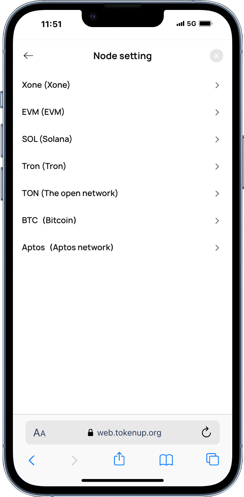

# Custom Tokens
"Custom Token" provides users with the function of quickly adding tokens, including custom networks and networks that the wallet already supports natively. The "Custom Token" function only supports tokens that already exist on the blockchain, and users are required to accurately enter the contract and precision of the token; otherwise, it cannot pass the blockchain verification and cannot be added.

Why can't the token be added?

We can check it through the following steps:

1. Please confirm whether the token you entered has been issued on the current network

2. Please confirm whether your token contract, precision, and name are entered correctly

3. Go to "Settings" - "Node Settings" - Select the main network node to check whether the current node is available.

</img>

**Beware of phishing**

Since the TokenPocket wallet cannot verify the authenticity of custom tokens, users must confirm the accuracy of the token information when adding custom tokens, including but not limited to the contract, precision, and name. At the same time, DApp and DeFi can also initiate requests to users to add or overwrite custom tokens through the universal interface. When adding, please be sure to confirm multiple times whether the token's contract, name and other information are correct.