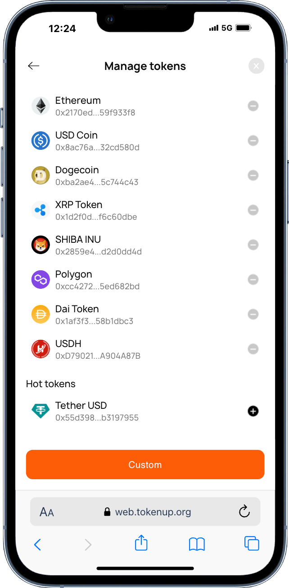
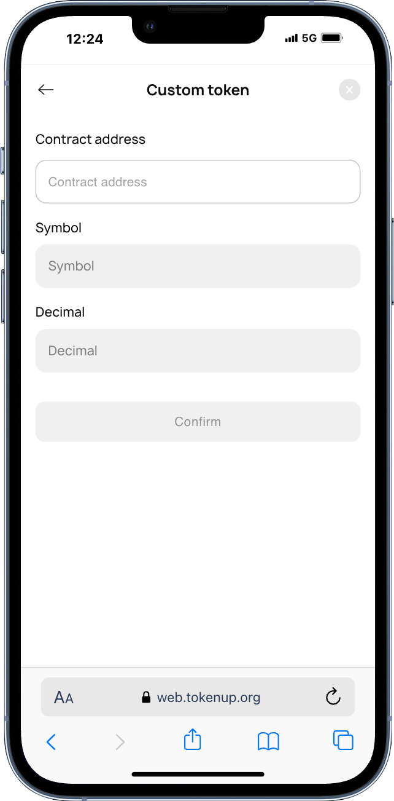
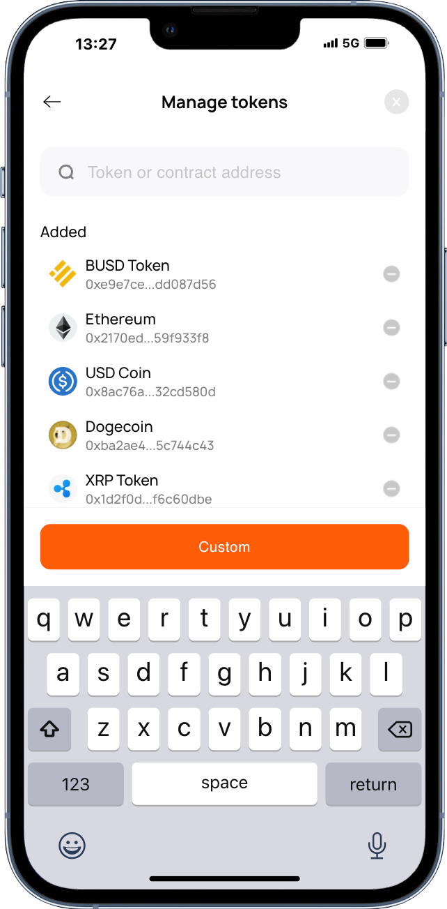
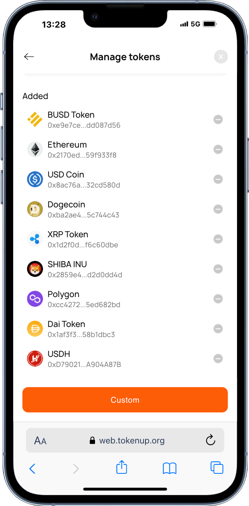

# How to add tokens

1. Open TokenUp, select the wallet you want to add tokens to, and click [+] on the [Manage Tokens] page to add new popular tokens.

</img>

2. If the token you want to add is not in the popular token list, copy the token or contract address you want to add, and click the custom button to add it yourself.

</img>

# How to sear
ch for tokens
Open TokenUp,click Manage Tokens, and enter the token name or contract address you want to search in the search box. If this token is not a popular token, you can add the token before you can see this asset.

</img>

# How to delete tokens
Open TokenUp, click Manage Tokens, and click [-] on the [Manage Tokens] page to delete the token assets you don't want to see.

</img>

**Tip: If you import other wallet addresses, you need to add tokens yourself to display assets**