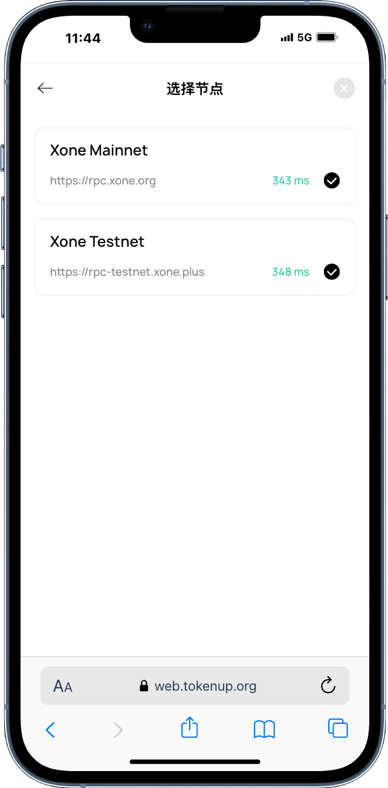

# 自定义代币

“自定义代币”给用户提供了快速添加代币的功能，包括自定义网络及钱包已原生支持的网络。 ”自定义代币“功能仅支持已存在区块链的代币，需要用户准确输入代币的合约、精度；否则无法通过区块链校验，而无法添加。

为什么无法添加代币？

我们可以通过以下几个步骤检查： 

1. 请确认你输入的代币是否在当前网络进行了发行。

2. 请确认您的代币合约、精度、名称是否输入正确。

3. 前往”设置“-”节点设置“-选择主网节点，检查当前节点是否可用。

</img>

**谨防钓鱼**

由于TokenPocket钱包无法验证自定义代币的真伪性，因此用户在添加自定代币时，务必确认代币信息的准确性，包括但不仅限于合约、精度、名称。 同时，DApp、DeFi通过通用接口也可以向用户发起添加或覆盖自定义代币的请求，在添加的时候请务必多次确认代币的合约、名称等信息是否正确。