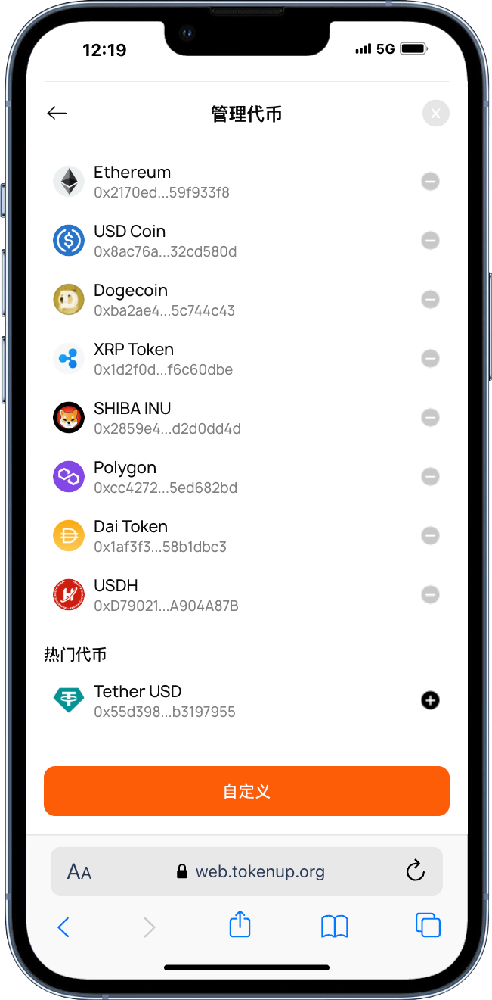
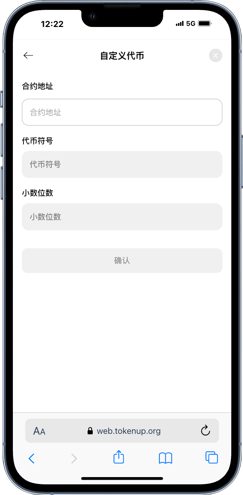
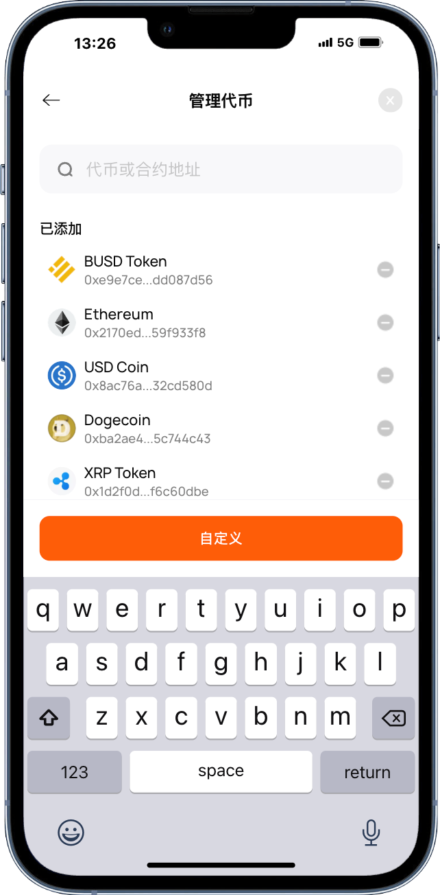
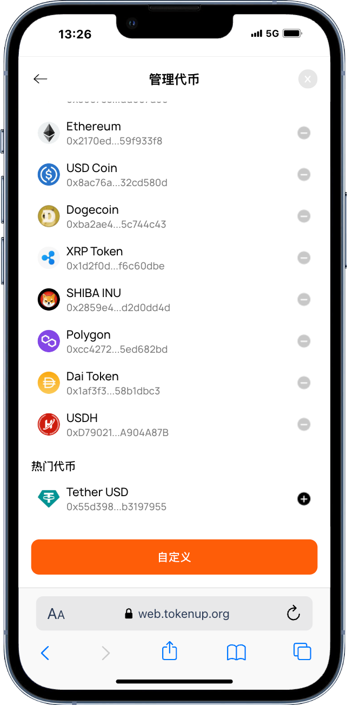

# 如何添加代币

1.打开TokenUp，选择你所需要添加代币的钱包，在【管理代币】页面点击【+】添加新的热门代币。

</img>

2.如果您想要添加的代币没有在热门代币列表中，请复制您想要添加的代币或合约地址，点击自定义按钮自行添加。

</img>

# 如何搜索代币
打开TokenUp，点击管理代币，在搜索框输入你想要搜索的代币名词或者合约地址，如果此代币不是热门代币，可以先进行代币添加才可以看到此资产。

</img>

# 如何删除代币
打开TokenUp，点击管理代币，在【管理代币】页面点击【-】删除您不想要看见的代币资产。

</img>

**提示：如您将其他钱包地址导入后，需自行添加代币才能显示资产**