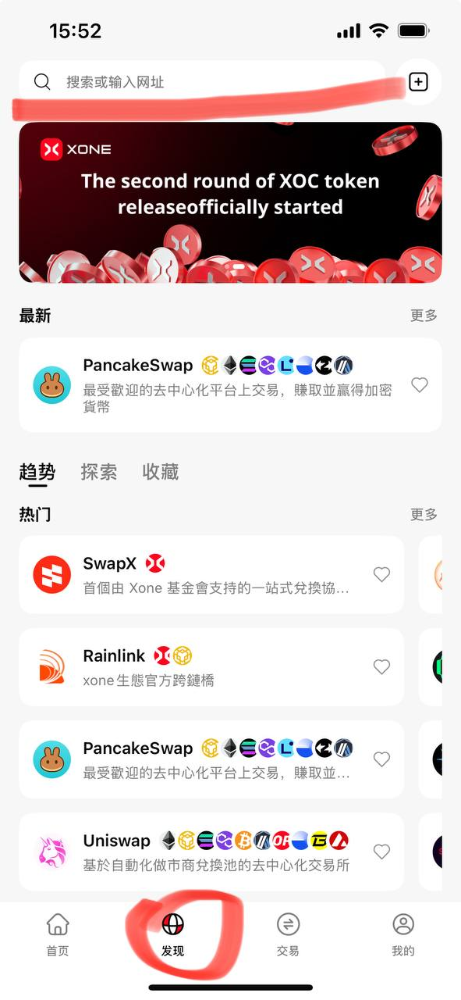
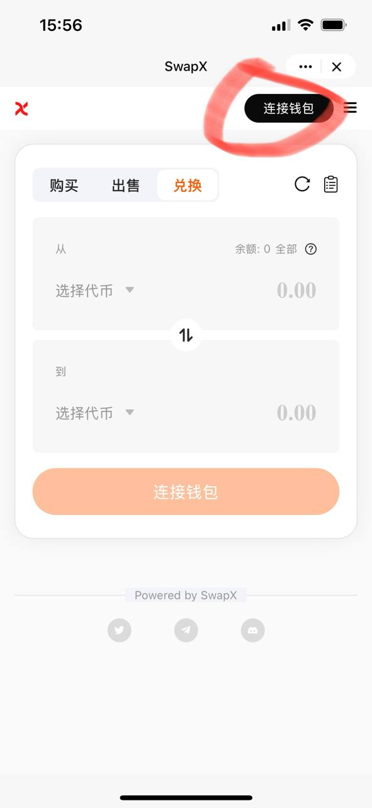
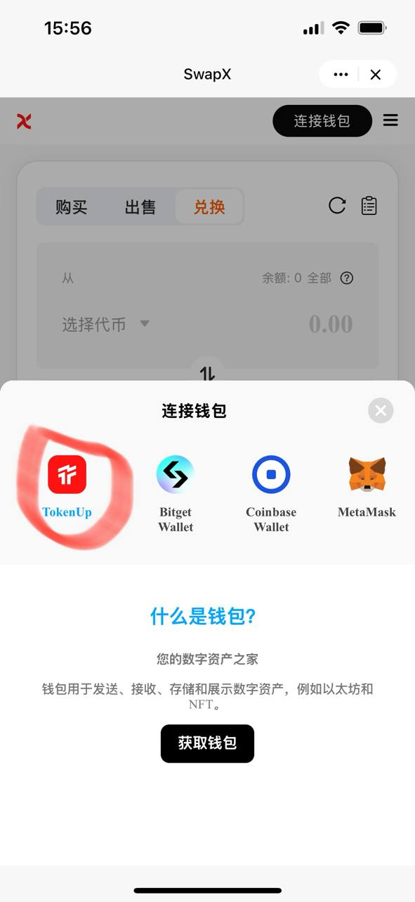

# DAPP新手友好教程

TokenUp内集合了上百种主流的DApp，方便客户交易

## 搜索DApp

通过名称或URL查找：如果您已经知道要查找的DApp的名称或URL，直接在搜索框中输入即可。输入时，请注意DApp名称中是否包含空格。

---

## 连接您的钱包

在DApp的首页上，通过点击“连接钱包”、钱包图标或“登录”按钮（通常位于右上角，但某些DApp可能会将其放置在左侧）来连接您的钱包。如果这些选项未显示，无需担心，许多DApp会在您尝试使用特定功能时提示您连接钱包。

例如，在SwapX中，点击“连接钱包”，然后选择“TokenUp”来进行连接。

选择好主网并连接钱包之后，选择您希望进行的操作（如确认、存款、转账）。操作请求会在屏幕底部弹出。在调整好详细信息和费用后，点击“确认”以继续您的操作。接下来，只需耐心等待操作完成即可。

---

## 交互过程中的常见问题

1) 为什么我的账户明明有资产，但在使用某 DApp 时却无法点击确认按钮或显示余额不足？

可能是因为您的资产在 A 主网上，但您想要进行交互的是在 B 主网上的，所以系统提示您在 B 主网上的余额不足。DApp 页内推荐的其他 DApp，进行资产跨链后再次尝试交互。

 

2) 我可以取消 DApp 内的订单吗？

如果是链上交易，一旦交易成功，由于区块链的去中心化和不可更改的特性，一般是无法取消的。若质押类的交易，您想退出质押时，可以在 DApp 内的质押页面中取回您的资产。如遇特殊情况，建议您第一时间加入正在使用的 DApp 官方社群联系官方客服协助您解决问题。

 

3) Dapp 内的资产为什么无法取回？

如果您授权给某些并不了解的 DApp 后，您的资产可能将由 Dapp 的智能合约所支配（也就是 Dapp 发行方，智能合约由项目方的技术人员所写）。

所以一旦授权给了某 Dapp，当资产出现问题时应该第一时间找该 DApp 的官方客服进行反馈。

钱包其实只是方便大家访问 DApp 的一个浏览器入口，对您的资产没有任何控制权。假设您通过 TokenUp 访问了某DEX 的 DApp 页面，授权之后在该 DEX 里进行充值或质押的资产无法取回，您需要立即联系该 DEX 的官方客服来反馈问题和找回资产。
