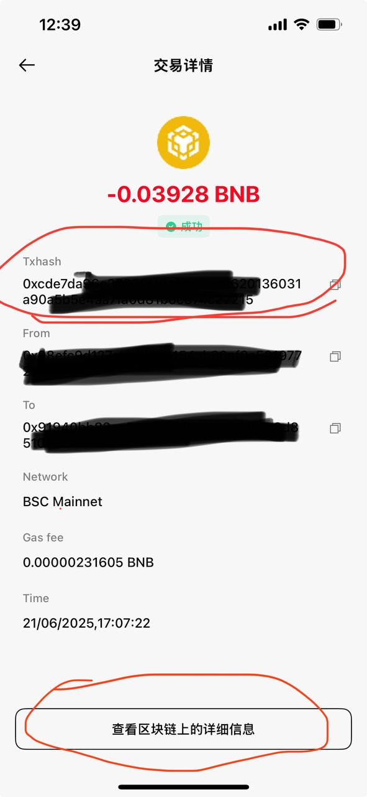
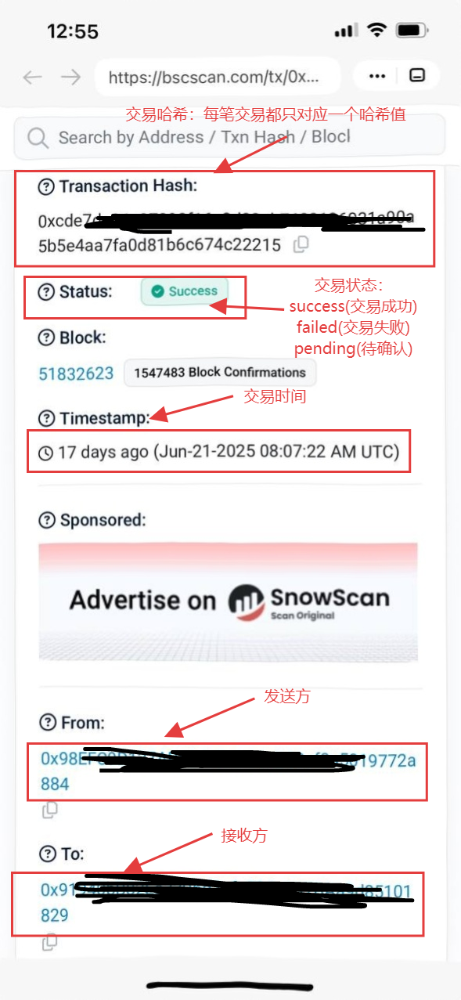
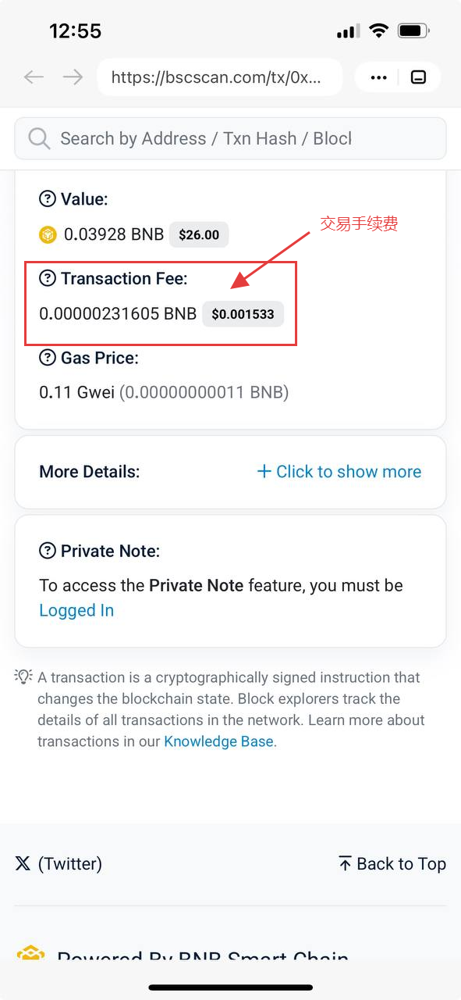
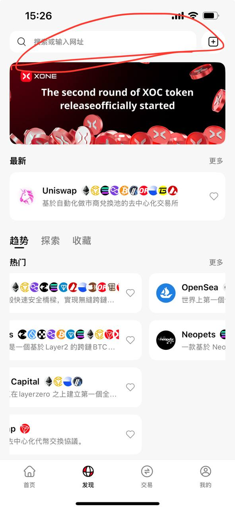
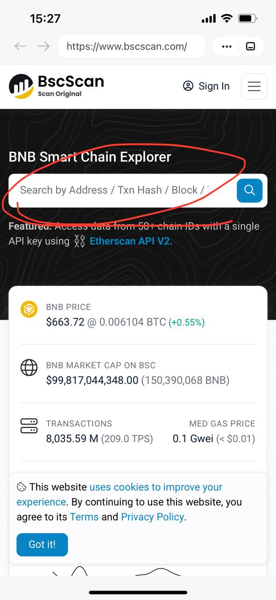

# 区块浏览器使用教程

## 什么是区块浏览器？

区块链浏览器，是一种搜索工具，也是一个网站，专门为用户提供浏览和查询区块链上信息。 因为区块链公开透明的特质，它需要一个媒介让用户看到链上的情况，区块链浏览器就是这个媒介。 在区块链浏览器中，只需要输入某笔交易的哈希值，钱包地址或合约地址等，即可查询它们的详细信息。

常见的区块浏览器有：

BTC: [https://blockchair.com/bitcoin](https://blockchair.com/bitcoin)

BSC: [https://www.bscscan.com/](https://www.bscscan.com/)

ETH: [https://etherscan.io/](https://etherscan.io/)

zkSync Era ∎ : [https://explorer.zksync.io/](https://explorer.zksync.io/)

Polygon（Matic）: [https://polygonscan.com/](https://polygonscan.com/)

TRON: [https://tronscan.org/#/](https://tronscan.org/#/)

Optimism: [https://optimistic.etherscan.io/](https://optimistic.etherscan.io/)

Heco: [https://www.hecoinfo.com/](https://www.hecoinfo.com/)

OKXChain: [https://www.oklink.com/okc](https://www.oklink.com/okc)

Aptos: [https://explorer.aptoslabs.com/](https://explorer.aptoslabs.com/)

Arbitrum: [https://arbiscan.io/](https://arbiscan.io/)

Fantom: [https://ftmscan.com/](https://ftmscan.com/)

Avalanche C-Chain: [https://avascan.info/](https://avascan.info/)

Polkadot: [https://explorer.polkascan.io/polkadot](https://explorer.polkascan.io/polkadot)

Aurora: [https://explorer.aurora.dev/](https://explorer.aurora.dev/)

Moonbeam: [https://moonbeam.moonscan.io/](https://moonbeam.moonscan.io/)

Conflux: [https://www.confluxscan.net/](https://www.confluxscan.net/)

ETC: [https://etcblockexplorer.com/](https://etcblockexplorer.com/)

Cosmos: [https://atomscan.com/](https://atomscan.com/)

EOS: [https://bloks.io/](https://bloks.io/)

Klaytn: [https://scope.klaytn.com/](https://scope.klaytn.com/)

Wax: [https://wax.bloks.io/](https://wax.bloks.io/)

IOST: [https://explorer.iost.io/](https://explorer.iost.io/)

Gnosis Chain: [https://explorer.poa.network/xdai/mainnet/](https://explorer.poa.network/xdai/mainnet/)

Dogecoin: [https://dogechain.info/](https://dogechain.info/)

PlatON: [https://scan.platon.network/](https://scan.platon.network/)

Kusama: [https://kusama.polkastats.io/](https://kusama.polkastats.io/)

Nova: [https://nova.arbiscan.io/](https://nova.arbiscan.io/)

Harmony: [https://explorer.harmony.one/](https://explorer.harmony.one/)

BTTC: [https://bttcscan.com/](https://bttcscan.com/)

KCC: [https://explorer.kcc.io/](https://explorer.kcc.io/)

HALO: [https://browser.halo.land/](https://browser.halo.land/)

Filecoin FVM: [https://filscan.io/](https://filscan.io/)

HAQQ Network：[https://explorer.haqq.network/](https://explorer.haqq.network/)

Core DAO：[https://scan.coredao.org/](https://scan.coredao.org/)

ZetaChain：[https://explorer.zetachain.com/](https://explorer.zetachain.com/)

Polygon zkEVM：[https://zkevm.polygonscan.com/](https://zkevm.polygonscan.com/)

Scroll: [https://blockscout.scroll.io/](https://blockscout.scroll.io/)

---

## 什么是哈希值（交易哈希）？

交易哈希（Transaction Hash）又称TxHash，其中的Tx ，就是交易Transaction 的缩写。每笔交易送上区块链时，都会获得一组独一无二的交易编码，也就是转帐记录编号。

每笔交易完成后，在交易记录页面都会显示该笔交易的哈希值。

1. 哈希值查询（以BSC为例：从交易记录里，点击一笔转账/收款,进入交易详情页点击“查看区块链上的详细信息”）

区块链上的详细信息内容介绍

2. 没有交易哈希怎么查询交易记录？（以BSC为例）

打开TokenUp APP，在DApp浏览器内输入[https://bscscan.com/](https://bscscan.com/)，进入BSC区块浏览器。在搜索栏输入发送方或接收方钱包地址，找到相对应时间的那笔转账记录即可查看相关信息。

