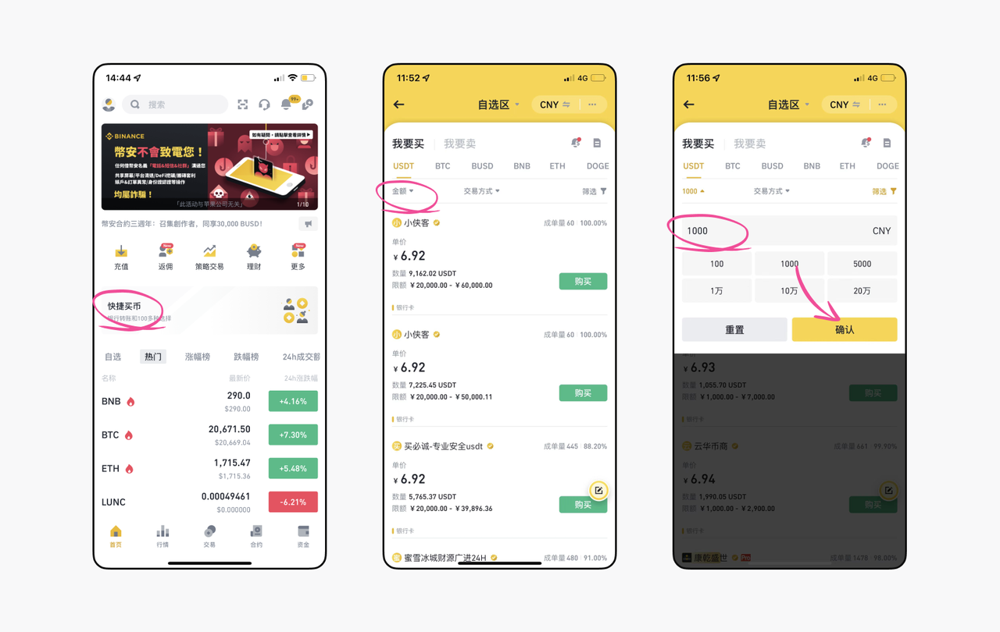
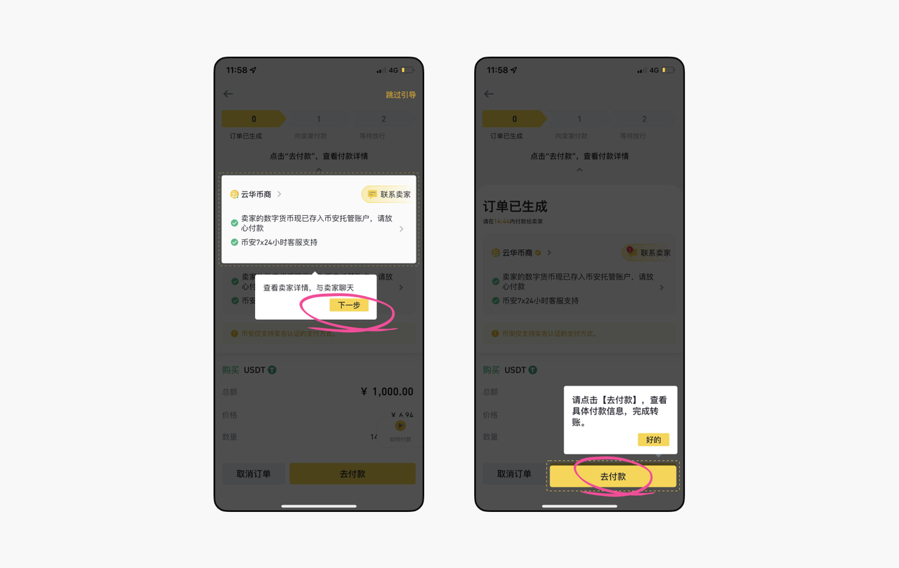
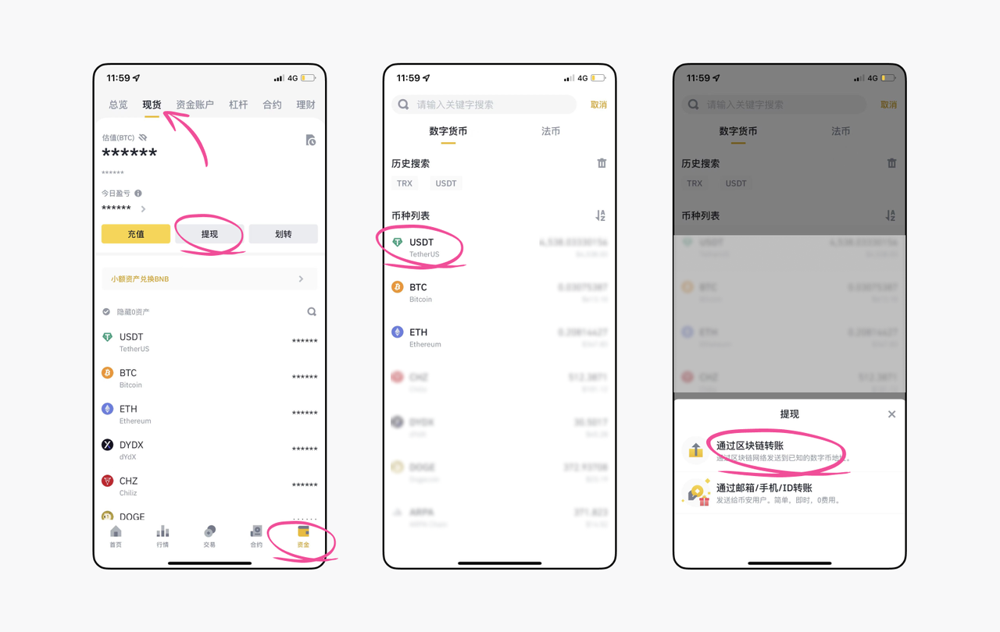

# 如何从币安入金和提现至TokenUp？

## 如何买币
 

1. 选择P2P方式购买加密货币

注册币安账号完成KYC验证后，点击首页【快捷买币】，右上角可以选择购买币种的法币，选择法币CNY；

回到购买页面后点击左侧【金额】设置购买的最低限额，有些商家最低限额较大，所以需要通过设置范围来筛选商家，比如教程中设置的为1000CNY，点击【确认】即可选择显示【购买】的商家，按照提示完成转账和确认USDT到账即可。

---

## 如何提币（以 USDT 为例）

1. 选择代币

打开币安交易所App，依次点击 【资金】-【现货】-【提现】，选择你要提的代币，这里以USDT为例。点击【通过区块链转账】将跳转至转账页面。

2. 注意转账网络

币安提供7种 USDT 提币网络：BEP20 、AVAX-C-Chain 、BEP2 、 ERC20、 Polygon 、Solana 、和TRC20。

一般转账USDT使用BEP20、Polygon、TRC20网络较多，手续费均≈1U，比较便宜。如果用户提币至钱包是为了使用DApp或其他链上交互，根据DApp和交互活动所支持的公链选择即可，比如要使用DApp仅支持BSC链，则最好直接提币BEP20链的USDT。这里我们以提出TRC20的USDT为例：

   - 进入填写转账信息的页面后，从币安APP切换至TokenUp，我们需要先来复制收币地址。

   - 打开TokenUp APP，点击【切换网络】切换主网至TRON，然后点击地址旁边的【复制】图标复制该地址；

   - 复制地址后，从TokenUp 切换回币安页面，粘贴TokenUp 钱包地址，选择【转账网络】【转账数量】等，然后点击【转账】，再次核对本次转账信息，点击【确认】

温馨提示：

当您将资产从钱包转出时，需要使用特定币种支付矿工费，因此请确保您的钱包内有充足的特定币种用于支付矿工费用。

完成以上密码及验证后，交易所会显示提币成功界面，此时您就可以在 TokenUp 中看到您刚刚转入的代币了。提币完成后，您可以可以在TokenUp 内兑换其他币种或购买NFT、使用各类DeFi应用等，畅游Web3.0世界。