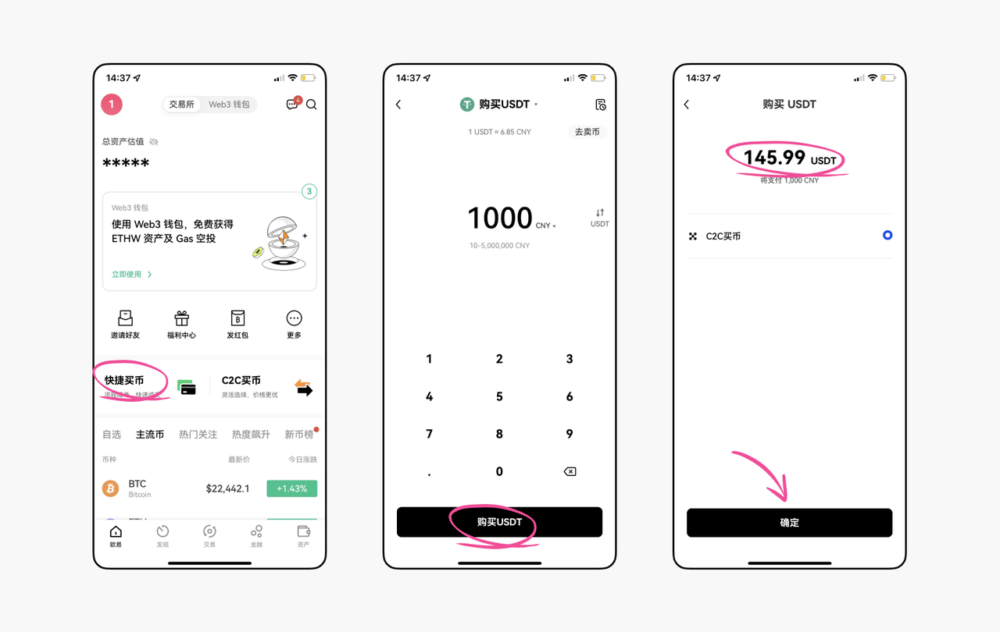
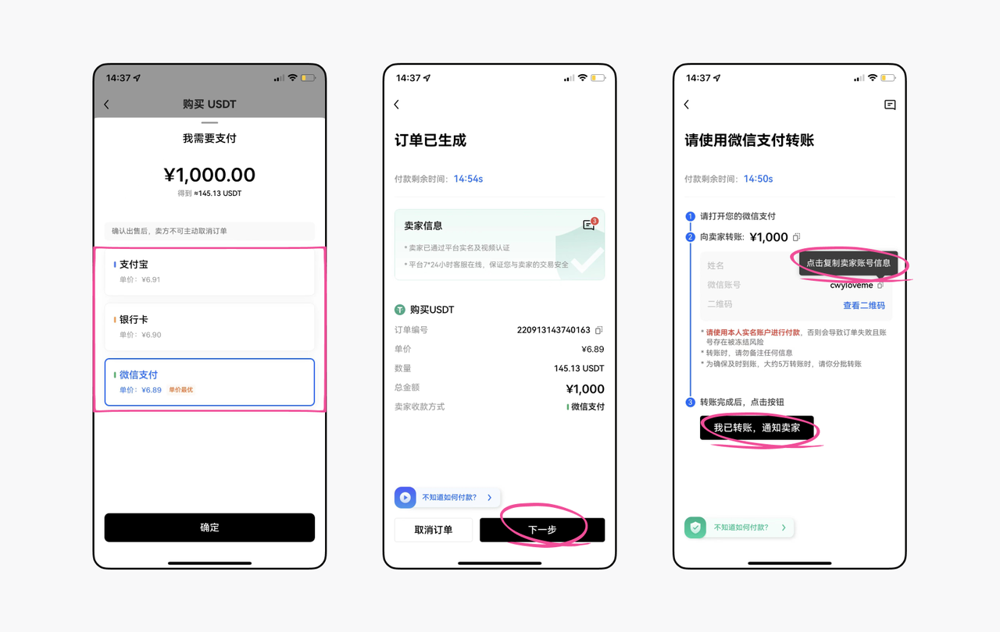
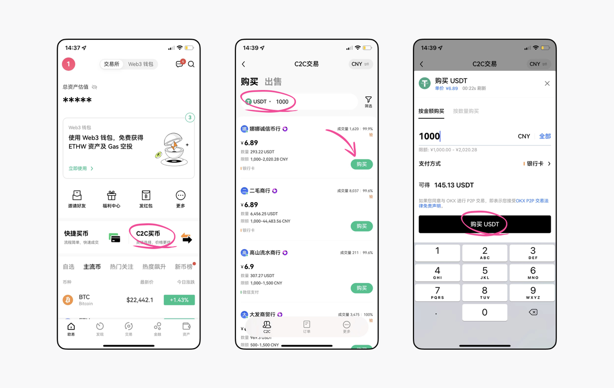
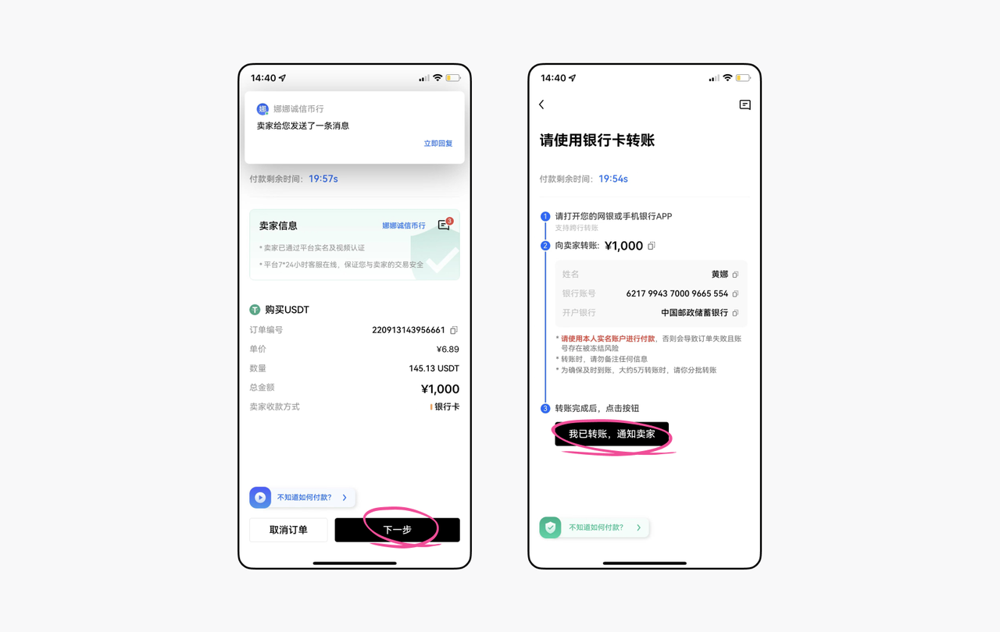

# 如何从OKX入金和提现至TokenUp？

## 如何买币

1. 快捷买币

点击【快捷买币】，输入买入金额，确认兑换的币种数量，点击【确定】；

选择其中一种支付方式，订单生成后点击【下一步】，根据提示向商家转账后即可等待到账。

2. C2C买币

点击C2C买币后，通过购买金额筛选合适的商家，点击【购买】，输入买币金额；订单生成后点击【下一步】，按照提示转账给商家后等待到账即可。

---

## 如何提币

打开OKX - 资产 - 提现 ，选择加密货币 - 默认【链上转账】- 输入数量 - 选择TokenUp 支持的网络 - 输入 TokenUp 所在网络的对应币种地址 - 确认并提交信息 - 完成转账，

此时您就可以在 TokenUp 中看到您刚刚转入的代币了。

温馨提示：

1. 转账USDT使用BEP20、Polygon、TRC20网络较多，手续费均≈1U，比较便宜；

2. 如果用户提币至钱包是为了使用DApp或其他链上交互，根据DApp和交互活动所支持的公链选择即可主网，比如要使用DApp仅支持BSC链，则最好直接提币BEP20链的USDT。