# TokenUp创建钱包

TokneUp钱包创建钱包的方式

## **iOS - 支持Appleid、google账号、助记词、导入助记词、导入私钥创建钱包**

[如何注册Apple Id](../manual/signupid.md)

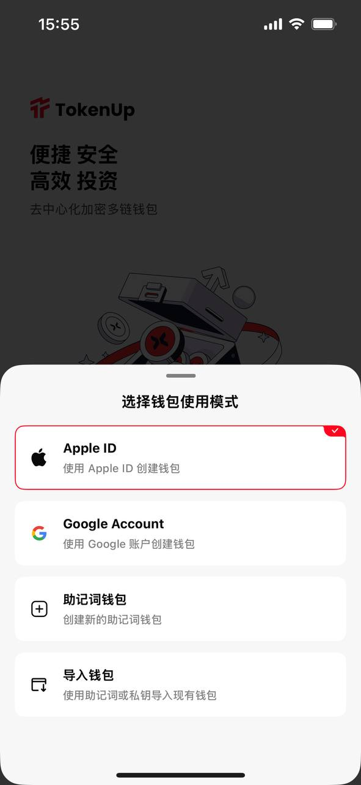

## **Android - 支持google账号、助记词、导入助记词、导入私钥创建钱包**

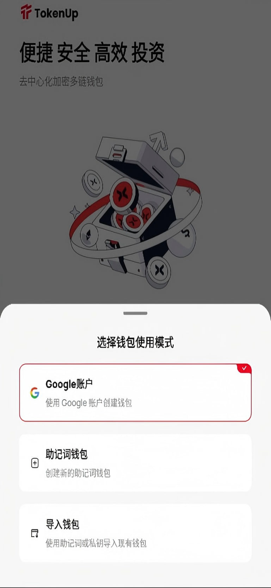

---

## **助记词注册**

1. **登录页面选择助记词钱包**

    

2. **设置密码**

    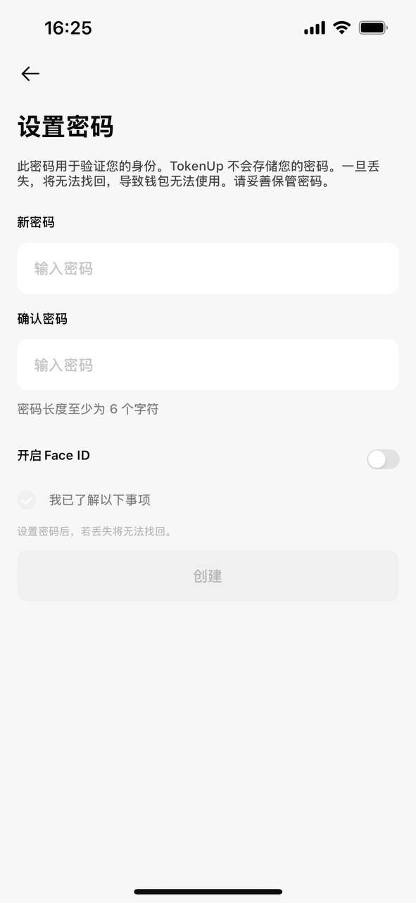

3. **备份助记词**（**在记录助记词前，请务必知悉：资产由私钥和恢复短语控制，一旦泄露，他人可控制您的资产！切勿向任何人（包括我们）泄露私钥或恢复短语！请准确抄写恢复短语并妥善保存在安全的地方，切勿通过网络传输或存储！请勿对私钥和恢复短语截图，以防被恶意软件截取**）

    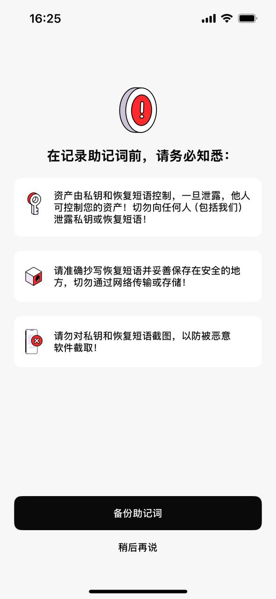

4. **记录助记词**

    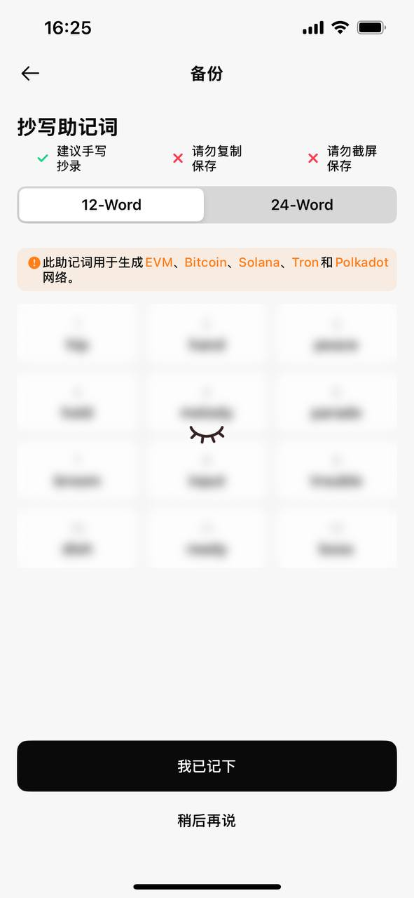

    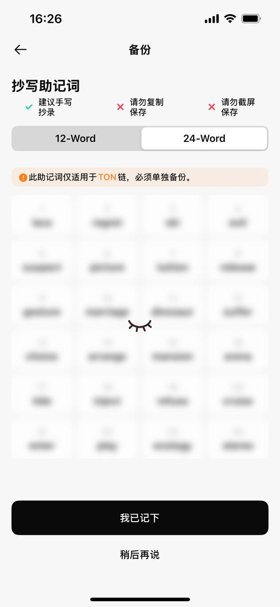

5. **根据序号选择你记录的助记词**

    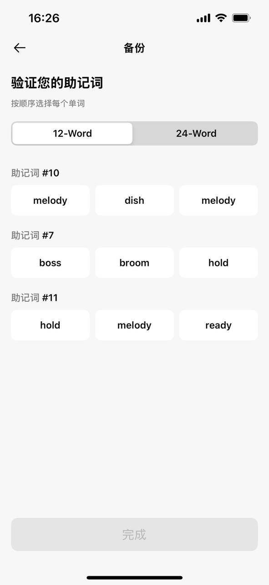

    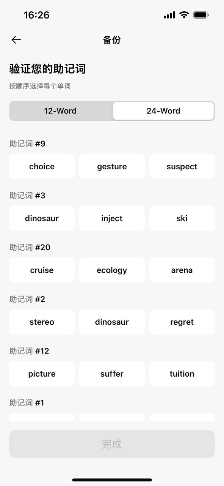

---

## **导入助记词**

1. **选择导入钱包**

    

2. **导入方式选择助记词**

    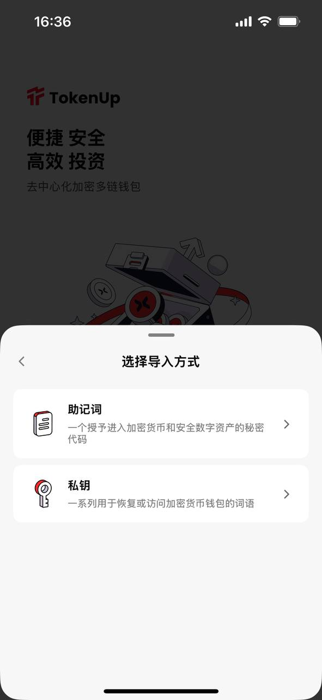

3. **设置密码**

    

4. **粘贴您在其它钱包的助记词**

    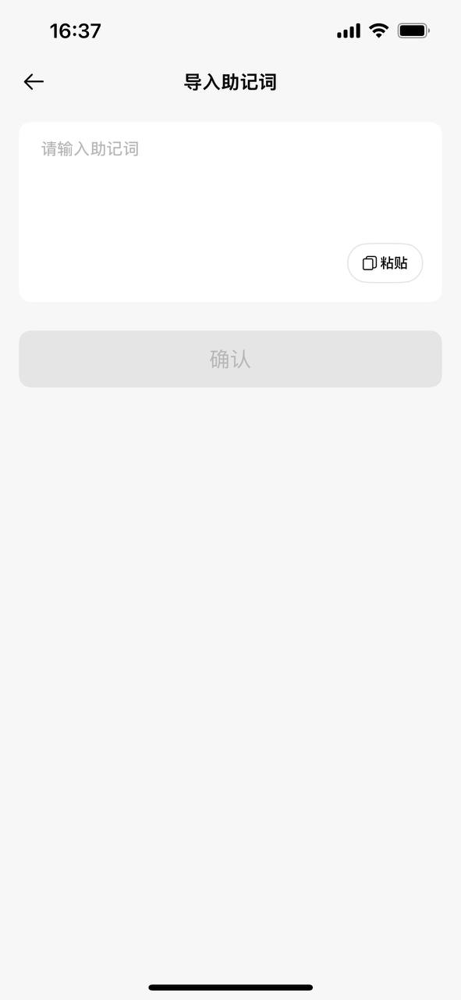

---

## **导入私钥**

1. **选择导入钱包**

    

2. **导入方式选择私钥**

    

3. **设置密码**

    

4. **选择链**

    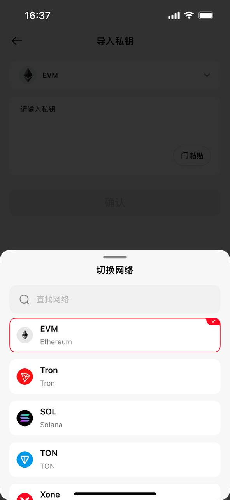

5. **粘贴您在其它钱包的链的私钥**

    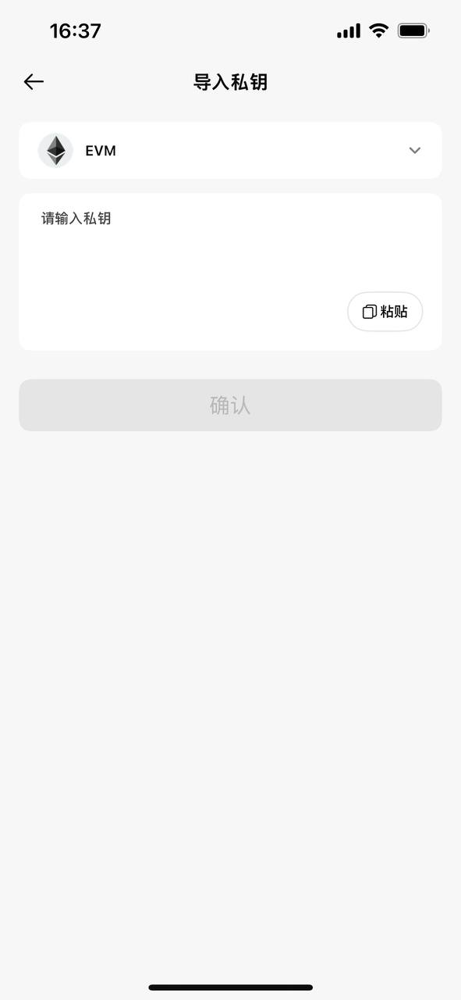