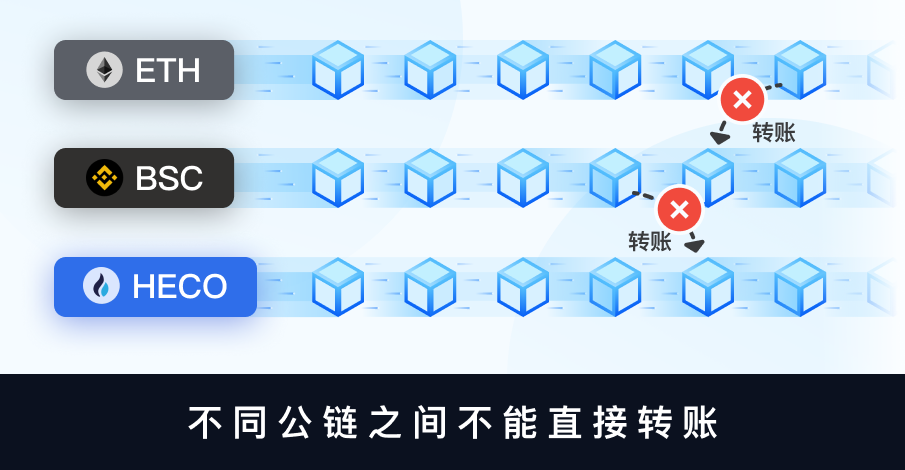

# 关于不同公链的代币转账

通过本文了解不同公链的代币收款与转账的注意事项

EVM是以太坊虚拟机链的简称，是与以太坊虚拟机（EVM）兼容的区块链网络，如以太坊、BNB Chain、Polygon、Arbitrum等公链。

由于跨链的需求不断增加，因此不同公链上会出现同一种资产，比如USDT在ETH、BSC、Polygon、Arbitrum等公链都可流通，虽然不同公链可以使用相同的地址来收取资产，但是他们之间的资产不可以直接相互转账。

**注意点：**

1.不同公链之间不可以直接相互转账，比如以太坊上的USDT无法直接转账到其他EVM链上。 

2.交易所提币，要注意选择提币网络。例如从币安提币到BSC钱包（币安智能链），就必须选择BEP20或者BSC选项，否则无法到账。