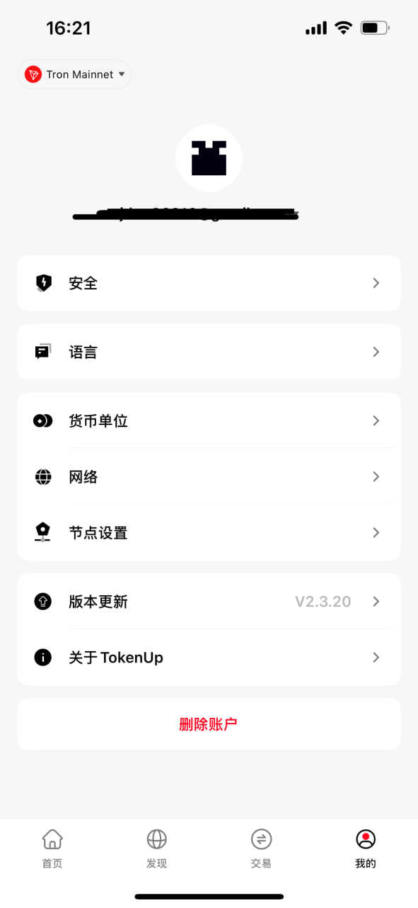

# 关于自定义网络

## 1. 什么是自定义网络

随着区块链生态的发展，构建与以太坊兼容的另一个区块链或网络，然后允许用户在这些网络之间执行链上交互成为了一种有效解决方案。这种做法不仅提供了更高的灵活性，以满足特定应用需求，还加强了整个区块链生态系统的互操作性。随着这一趋势的推动，越来越多的项目选择在以太坊基础上构建定制化的区块链网络，以适应不断增长的区块链和加密资产市场的需求。

在这个过程中，用户需要使用一系列关键信息，包括网络名称、RPC地址、链ID、货币符号等，这些信息通常由项目方或开发者提供。通过自定义网络，用户能够在其钱包中整合非主流或新兴的区块链项目，执行交易、查询余额等操作，实现更广泛的数字资产管理选择。

---

## 2. TokenUp自定义网络的添加途径

- 移动端：打开TokenUp移动端

- 点击右下角“我的”

- 选择“网络”

- 选择“添加EVM网络”

- 按要求填入内容后保存

        
---

## 3. 自定义网络风险防范

    - 项目风险
    用户添加的自定义网络可能源自新兴或非主流的区块链项目。这些项目可能存在技术缺陷、市场风险或其他潜在问题，可能导致资产损失或价格波动。因此，在选择自定义网络时，务必谨慎，并选择那些经过充分验证且安全可靠的项目。并非所有网络（公链）都具备同等的安全性。

    - 隐私风险
    在使用自定义网络时，用户的交易信息可能会通过RPC接口暴露给第三方，可能导致用户的隐私泄露，特别是当自定义网络的RPC接口由不受信任的方提供时。为确保隐私安全，建议用户审慎考虑RPC接口的来源，并避免使用由不受信任方提供的接口。

    同时，用户应确保自定义网络信息的准确性和正确性。为方便用户，可以在 https://chainlist.tptool.pro/ 上查找网络，以便自动将其添加到 TokenPocket。

    - 转账风险
    不要通过不同的网络间转移代币，因为不同网络间的转移会导致代币无法到账，尽管自定义网络可能与以太坊兼容，但它们与以太坊主网不同。不同EVM公链之间的地址、私钥、助记词都可以是相同的，所以如果发生了不同网络错误转账，可以使用私钥或助记词进行找回。

    - 使用风险
    了解自定义网络（公链）中的运行机制也是非常重要的。在使用交互时，需要使用该公链主网上的本地代币。换言之，执行交易、合约互动或其他操作时，确保您拥有足够的该公链主网代币来支付相关费用。这种主网代币的使用是确保在自定义网络上正常进行各种操作的关键，因此在与该公链进行任何互动之前，了解并确认您的账户中有足够的主网代币是十分重要的。

    - 法律和监管风险
    在某些国家和地区，使用自定义网络可能受到法律和监管限制。用户需要确保自己遵守当地的法律法规，以避免潜在的法律风险。