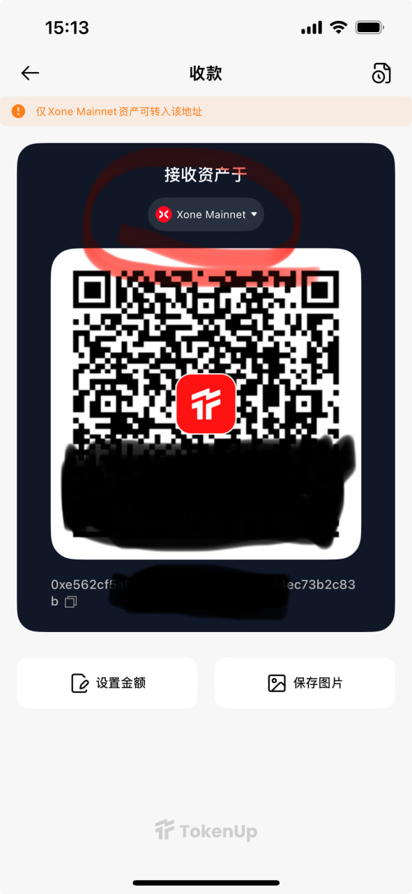

# 如何获取你的 EVM 钱包地址？

在加密货币世界中，EVM（以太坊虚拟机）钱包地址是你与区块链网络交互的核心。无论是进行交易、转账、与热门项目交互、参与活动，拥有一个 EVM 钱包地址都是必不可少的。本文将详细介绍如何在 TokenUp 中获取和管理你的 EVM 钱包地址，帮助你更高效、安全地管理资产并参与区块链生态。

##什么是 EVM 钱包地址？

EVM 地址（以太坊虚拟机地址）是以太坊和一些兼容的区块链网络中用于标识账户的唯一地址。它是一个由 42 个字符组成的字符串，通常以 "0x" 开头，后面跟着 40 个数字和字母的组合（例如：0x1a5FdBc891c5D4E6aD68064Ae45D43146D4F9f3a）。

你可以把它想象成一个加密钱包的账户号码，用户通过这个地址来接收、存储和发送加密资产（如代币和 NFT）。这个地址是通过复杂的加密算法生成的，确保只有你能控制和管理你的资产。对于初次接触 Web3 的人来说，可以简单理解为你在区块链世界中的“收款账户”。

---

## EVM 地址的核心特征

   - 跨链兼容性：可在所有 EVM 兼容链（如 BSC、Polygon 等）中使用同一地址格式

   - 区分大小写：地址字母均为小写（部分链支持校验和大写格式）

   - 不可逆生成：通过私钥单向推导生成，无法反向推算私钥

---

## 主流 EVM 兼容公链

|主网名称|原生代币|主要特点|
|-------|--------|--------|
|以太坊主网（Ethereum）|ETH|智能合约开创者，生态最成熟|
|BSC（币安链/BNB Chain）|BNB|低 Gas 费，高吞吐量|
|Polygon|POL|以太坊Layer2 扩容解决方案|
|Arbitrum|ETH|Optimistic Rollup 技术代表|
|Optimism|ETH|主流 Layer2 方案|
|Base|ETH|由 Coinbase 推出的以太坊 Layer 2 解决方案|
|Avalanche C链|AVAX|高性能 EVM 兼容链|
|Morph|ETH|全球消费级 Layer 1 网络|
|zkSync Era|ETH|以太坊扩容的 zk-Rollup 解决方案|
|Linea|ETH|由 ConsenSys 构建的 zkEVM 网络|
|Mantle|MNT|由 BitDAO 孵化的模块化 Layer 2 网络|
|Blast|ETH|高效的以太坊 Layer 2 扩展解决方案|
|Berachain|BERA|基于Cosmos SDK 构建的 Layer 1 网络|
|Story|IP|专门为知识产权（IP）设计的 Layer 1 网络|
|Scroll|ETH|以安全为中心的以太坊扩容解决方案|

---

## 如何在 TokenUp 查找/复制 EVM 地址？

当你复制 EVM 钱包地址时，不论是在以太坊、BSC、Polygon 等任何 EVM 主网，地址格式都是相同的。只要切换到相应的主网，你就可以复制你的 EVM 地址进行操作。这样，无论在哪个主网，你都能轻松使用同一个地址接收代币。

根据以下教程复制你的 EVM 地址：

1. 下载 TokenUp，创建/导入钱包

下载并打开 TokenUp，确保已创建/导入 EVM 兼容钱包；

2. 选择EVM链的主网进入，点击余额下的地址进行复制

3. 进入收款，选择EVM主网，地址在二维码下面

---

## 常见问题解答

Q1: 同一个 EVM 地址能在所有链上使用吗？

虽然 EVM 地址格式是一样的，但每条链是独立的账本。为了确保转账成功，你需要：

   - 确保目标链上有足够的资产余额（用于支付 Gas 费）。

   - 确保你想转账的代币在目标链上有对应的合约部署。

 

Q2: 如何确保我复制的 EVM 地址是正确的？

在复制地址时，确保你选择的是正确的网络（如以太坊、BSC 等），并且检查地址的前缀是 "0x"。你可以通过粘贴地址到收款页面确认是否正确。

Q3: 如何防止不同链之间转账错误？

双重验证：粘贴地址前，仔细核对地址的前 4 位和后 4 位字符

小额测试：首次转账先发送最小金额

使用跨链桥：通过 TookenUp 的 Swap 跨链，自动处理链与链之间的资产转换

---

## 总结

EVM 地址是 Web3 世界中的通用身份标识，具有多重核心价值：它支持跨链互操作性，让一个地址可以在多个主流网络间使用；它赋予用户自主控制权，真正实现「Not your keys, not your crypto」；同时，所有交易操作都在区块链上永久记录，确保交易透明可查。

TokenUp 建议通过「多链模式」管理不同网络的资产。在进行转账时，务必确认目标网络和地址是否匹配。并定期备份助记词，妥善存储在物理介质上。请始终牢记：区块链交易不可逆，操作时保持谨慎是保护资产的第一道防线！

