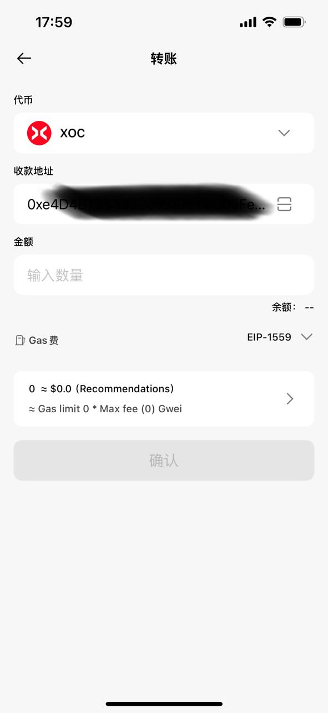

# TokenUp如何转账

## TokenUp扫码转账

1. **进入TokenUp钱包首页**

    

2. **选择扫码**

3. **扫码对方的收款地址二维码进入转账页面。注意： 不是同一条链的上的二维码无法扫描（如：Solana、Tron、Ton、BTC）！！！**

    

---

## TokenUp地址转账

1. **进入TokenUp钱包首页**

    

2. **选择转账**

3. **复制对方的收款地址或扫码。注意： 不是同一条链的上的地址转账代币会消失，无法追回，转账前请注意对方的收款地址！！！**

    

